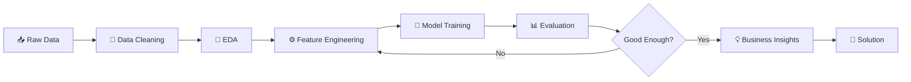

<h1 align="center">
  🧠 Hiren Keraliya — Data Scientist
</h1>

<p align="center">
  
</p>

<p align="center">
  <a href="https://github.com/hiren223">
    
  </a>
  <a href="https://www.linkedin.com/in/hiren-keraliya">
    
  </a>
  <a href="mailto:hirenkeraliya99@gmail.com">
    
  </a>
</p>

<p align="center">
  
  
</p>

---

## ⚡ `hiren-keraliya-v1`

> **A human, fine-tuned on curiosity, real-world datasets, and questionable amounts of debugging.**

```text
Model:        Hiren Keraliya
Version:      v1.0 — Actively Improving
Architecture: Python → Data → ML → Insights → Decisions
Primary Task: Solve real-world problems with data
Current Mode: Open to Full-Time Opportunities
Location:     Ahmedabad, India
```

<p align="center">
  
  
  
</p>

---

## 👨‍💻 About Me

I'm a **Data Scientist / Machine Learning Engineer / Data Analyst** focused on turning raw data into models, insights, and practical business decisions.

I have hands-on experience building **end-to-end machine learning pipelines**, performing EDA and feature engineering, evaluating multiple algorithms, and communicating technical findings to non-technical stakeholders.

During my **6-month Data Scientist internship at Rubixe**, I worked with **50,000+ records**, participated in **15+ client meetings**, identified **8+ critical data-quality issues**, and contributed to a **15% improvement in predictive analytics accuracy**.

### 🎯 What I Actually Do

```text
Raw Data
   ↓
Cleaning & Validation
   ↓
EDA
   ↓
Feature Engineering
   ↓
Model Building
   ↓
Model Evaluation
   ↓
Business Insights
   ↓
Better Decisions
```

I don't just ask:

> "What's the accuracy?"

I ask:

> **"Does this model actually solve the problem?"**

---

## 🧪 My Training Data

```yaml
education:
  degree: "Bachelor of Computer Application (BCA)"
  university: "Silver Oak University, Ahmedabad"
  period: "2022 - 2025"
  cgpa: "7.31 / 10"

professional_experience:
  company: "Rubixe — AI Solutions Company"
  role: "Data Scientist Intern"
  duration: "6 months"
  period: "Aug 2025 - Feb 2026"

experience:
  records_processed: "50,000+"
  client_meetings: "15+"
  data_quality_issues_identified: "8+"
  preprocessing_time_reduction: "40%"
  predictive_accuracy_improvement: "15%"
```

---

# 📊 Impact Dashboard

<p align="center">

<table>
<tr>

<td align="center" width="180">
<h2>50K+</h2>
<sub>Records Processed</sub>
</td>

<td align="center" width="180">
<h2>15%</h2>
<sub>Accuracy Improvement</sub>
</td>

<td align="center" width="180">
<h2>40%</h2>
<sub>Preprocessing Time Reduced</sub>
</td>

<td align="center" width="180">
<h2>15+</h2>
<sub>Client Meetings</sub>
</td>

</tr>

<tr>

<td align="center">
<h2>8+</h2>
<sub>Data Quality Issues</sub>
</td>

<td align="center">
<h2>95/100</h2>
<sub>NASSCOM Score</sub>
</td>

<td align="center">
<h2>Top 5%</h2>
<sub>Certified Performer</sub>
</td>

<td align="center">
<h2>7.31</h2>
<sub>BCA CGPA</sub>
</td>

</tr>
</table>

</p>

---

# 🚀 Featured Projects

## 📉 Customer Churn Prediction

**Machine Learning | Python | Scikit-learn | Pandas | NumPy | Matplotlib | Seaborn**

> Predicting which customers are likely to leave before they actually leave.

### 🔍 What I Built

* End-to-end customer churn prediction pipeline
* EDA on **50,000+ customer records**
* Identified **8 key churn indicators**
* Detected **5 behavioral patterns**
* Handled **3.5% missing values**
* Investigated **2 outlier clusters**
* Compared **6 classification algorithms**
* Selected the best model using **F1-score optimization**
* Built visualizations for non-technical stakeholders

### 🧠 Models Evaluated

```text
Logistic Regression
       ↓
Decision Tree
       ↓
Random Forest
       ↓
XGBoost
       ↓
SVM
       ↓
KNN
       ↓
Best Model → 0.79 Accuracy
```

<p align="center">
  
  
  
</p>

---

# 🌾 Krushi-Manch

### Digital Agriculture Platform

**HTML5 | CSS3 | JavaScript | PHP | MySQL | SQL**

A full-stack agricultural platform designed to bring multiple farming workflows into one system.

### 🚜 Platform Modules

```text
🌱 Digital Marketplace
       │
       ├── Sell Produce
       ├── 2,000+ Listings
       │
       ▼
🚜 Equipment Rental
       │
       ├── Inventory Management
       ├── 150+ Concurrent Transactions
       │
       ▼
💰 Expense Tracking
       │
       ├── EMI Calculator
       └── Income Planning
       │
       ▼
💬 Buyer Communication
```

### 📈 Project Impact

* Served **500+ beta-test farmers**
* Supported **2,000+ marketplace listings**
* Designed a relational database with **12+ optimized SQL tables**
* Supported **500+ active users**
* Supported **150+ concurrent rental transactions**
* Achieved **80% user satisfaction**
* Improved income-planning visibility by **80%**

---

# 🛠️ Technical Arsenal

### 🐍 Programming

<p>

</p>

### 📊 Data Science & Machine Learning

```text
Python
├── Pandas
├── NumPy
├── Scikit-learn
├── Matplotlib
├── Seaborn
└── Statistical Analysis

Machine Learning
├── Classification
├── Regression
├── Random Forest
├── Decision Trees
├── XGBoost
├── Feature Engineering
└── Model Evaluation
```

### 🗄️ SQL & Data

```text
SQL
├── JOINs
├── Subqueries
├── Window Functions
├── Data Cleaning
└── Relational Database Design
```

### 🔧 Tools

<p align="center">
  
</p>

**Also:** Jupyter Notebook • Google Colab • Power BI • Tableau

---

# 🧠 Machine Learning Workflow



---

# 📜 Certifications

| Certification                | Organization                 | Result              |
| ---------------------------- | ---------------------------- | ------------------- |
| 🏆 Certified Data Scientist  | NASSCOM / FutureSkills Prime | **95/100 — Top 5%** |
| 📘 Data Science Foundation   | IABAC                        | Certified           |
| 📊 Data Analytics Simulation | Deloitte Australia / Forage  | Tableau Dashboard   |

The NASSCOM certification was earned in June 2026 with a **95/100 score**, placing me among the **Top 5% performers**.

---

# 🧩 Problem-Solving Philosophy

```python
def solve_problem(data):

    data = understand(data)
    data = clean(data)
    insights = explore(data)
    features = engineer(insights)

    models = train_multiple_models(features)

    best_model = evaluate(
        models,
        metrics=[
            "precision",
            "recall",
            "f1_score",
            "roc_auc"
        ]
    )

    return translate_to_business_value(best_model)
```

### My rule:

**A high accuracy score doesn't automatically mean a good model.**

I learned to evaluate models using the metric that actually fits the problem rather than blindly optimizing accuracy.

---

# 📈 GitHub Activity

<p align="center">
  
  
</p>

<p align="center">
  
</p>

---

# 🐍 Contribution Graph

<p align="center">
  
</p>

---

# 🎯 Currently Working On

```text
[████████████████████░░] Machine Learning       90%
[█████████████████░░░░░] Data Analytics         85%
[███████████████░░░░░░░] SQL                    80%
[██████████████░░░░░░░░] Deep Learning          70%
[████████████░░░░░░░░░░] Advanced ML            65%
[███████████░░░░░░░░░░░] Data Engineering       55%
```

### 🔬 Current Learning Direction

* Advanced Machine Learning
* Deep Learning
* Model optimization
* Production-oriented ML workflows
* Better data storytelling
* Building practical AI applications

---

# 💼 Open to Opportunities

I'm currently looking for **entry-level opportunities** in:

```text
🎯 Data Scientist
🤖 Machine Learning Engineer
📊 Data Analyst
🧠 AI / ML Roles
```

I'm particularly interested in teams where I can work with **real-world datasets, predictive modeling, business analytics, and AI-driven products**.

---

# 📬 Let's Connect

<p align="center">

<a href="mailto:hirenkeraliya99@gmail.com">

</a>

<a href="https://www.linkedin.com/in/hiren-keraliya">

</a>

<a href="https://github.com/hiren223">

</a>

</p>

---

<p align="center">

### ☕ Debugging status


</p>

<p align="center">
  <sub>⚠️ Model occasionally overfits to good coffee and underperforms before 9 AM.</sub>
</p>

<p align="center">
  <sub>© 2026 Hiren Keraliya • Built with Python, curiosity & too many notebooks.</sub>
</p>
