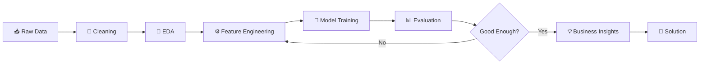

<div align="center">

# 🧠 Hiren Keraliya

### `Data Scientist` • `Machine Learning Engineer` • `Data Analyst`


<br>

<div align="center">

<a href="https://personal-portfolio--hirenpatel37.replit.app">
  
</a>

<a href="https://www.linkedin.com/in/hiren-keraliya">
  
</a>

<a href="mailto:hirenkeraliya99@gmail.com">
  
</a>

 </div>
</div>

---

# 🧠 `hiren-keraliya-v1`

> **A human, fine-tuned on curiosity, real-world datasets, and questionable amounts of debugging.**

```text
┌──────────────────────────────────────────────────────────┐
│                    MODEL INFORMATION                     │
├──────────────────────────────────────────────────────────┤
│ Name          : Hiren Keraliya                           │
│ Version       : v1.0 — Actively Improving                │
│ Role          : Data Scientist / ML Engineer / Analyst   │
│ Education     : BCA — Silver Oak University             │
│ Experience    : 6-Month Data Scientist Internship       │
│ Location      : Ahmedabad, India                         │
│ Status        : Open to Full-Time Opportunities         │
└──────────────────────────────────────────────────────────┘
```

---

# 👨‍💻 About Me

I'm a **Data Scientist / Machine Learning Engineer / Data Analyst** focused on turning raw data into useful insights, predictive models, and practical business solutions.

During my **6-month Data Scientist internship at Rubixe**, I worked with **50,000+ records**, contributed to a **15% improvement in predictive analytics accuracy**, reduced preprocessing time by **40%**, identified **8+ critical data-quality issues**, participated in **15+ client meetings**, and created **10+ executive-ready presentations**.

```text
Data
 ↓
Cleaning
 ↓
EDA
 ↓
Feature Engineering
 ↓
Machine Learning
 ↓
Evaluation
 ↓
Business Insights
 ↓
Decision
```

---

# ⚡ Impact Dashboard

<div align="center">

|      📊 50K+      |        📈 15%        |          ⚡ 40%        |   
| :---------------: | :------------------: | :---------------------: | 
| Records Processed | Accuracy Improvement | Preprocessing Reduction | 

|          🔎 8+         |   🏆 95/100   | 🎯 Top 5% |  🎓 7.31 |
| :--------------------: | :-----------: | :-------: | :------: |
| Data Issues Identified | NASSCOM Score | Performer | BCA CGPA |

</div>

---

<h2 align="center">🛠️ Tech Stack</h2>

<table align="center">
<tr>
<td align="center" width="120">
<br>
<b>Python</b>
</td>

<td align="center" width="120">
<br>
<b>Pandas</b>
</td>

<td align="center" width="120">
<br>
<b>NumPy</b>
</td>

<td align="center" width="120">
<br>
<b>Scikit-Learn</b>
</td>

<td align="center" width="120">
<br>
<b>SQL</b>
</td>
</tr>

<tr>
<td align="center" width="120">
<br>
<b>Jupyter</b>
</td>
  
<td align="center" width="120">
<br>
<b>Power BI</b>
</td>
<td align="center" width="120">
<br>
<b>VS Code</b>
</td>

<td align="center" width="120">
<br>
<b>Git</b>
</td>

<td align="center" width="120">
<br>
<b>GitHub</b>
</td>
</tr>

<tr>
<td align="center" width="120">
<br>
<b>HTML5</b>
</td>

<td align="center" width="120">
<br>
<b>CSS3</b>
</td>

<td align="center" width="120">
<br>
<b>JavaScript</b>
</td>

<td align="center" width="120">
<br>
<b>PHP</b>
</td>

<!-- Matplotlib -->
<td align="center" width="120">
<br>
<b>Matplotlib</b>
</td>

</tr>
<tr><td align="center" width="120">
<br>
<b>Seaborn</b>
</td></tr>
</table>

---

# 🚀 Featured Projects

## 📉 Customer Churn Prediction

### `Machine Learning • Business Case`

**Tech:** `Python` `Pandas` `NumPy` `Scikit-learn` `Matplotlib` `Seaborn`

### 🎯 Objective

Build an end-to-end machine learning pipeline to identify customers who are likely to churn.

### 🔬 Pipeline

```text
                    CUSTOMER DATA
                          │
                          ▼
                  ┌──────────────┐
                  │ Data Cleaning│
                  └──────┬───────┘
                         ▼
                  ┌──────────────┐
                  │     EDA      │
                  └──────┬───────┘
                         ▼
                  ┌──────────────┐
                  │   Feature    │
                  │ Engineering  │
                  └──────┬───────┘
                         ▼
              ┌──────────────────────┐
              │ 6 ML Algorithms      │
              ├──────────────────────┤
              │ Logistic Regression  │
              │ Decision Tree        │
              │ Random Forest        │
              │ XGBoost              │
              │ SVM                  │
              │ KNN                  │
              └──────────┬───────────┘
                         ▼
                  ┌──────────────┐
                  │ Model        │
                  │ Evaluation   │
                  └──────┬───────┘
                         ▼
                    79% ACCURACY
```

### 📊 Results

```text
50,000+        Customer Records
8              Key Churn Indicators
5              Behavioral Patterns
3.5%           Missing Values Handled
2              Outlier Clusters
6              Algorithms Evaluated
79%            Test Accuracy
```

---

# 🌾 Krushi-Manch

### `Digital Agriculture Platform`

**Tech:** `HTML5` `CSS3` `JavaScript` `PHP` `MySQL` `SQL`

A full-stack agricultural platform designed to bring multiple farming workflows into a unified system.

### 🚜 Core Modules

```text
┌─────────────────────────────────────────────┐
│                 KRUSHI-MANCH                │
├─────────────────────────────────────────────┤
│                                             │
│  🌱 Produce Marketplace                     │
│  🚜 Equipment Rental                        │
│  💰 Expense Tracking                        │
│  🧮 EMI Calculator                          │
│  📊 Income Planning                         │
│  💬 Buyer Communication                     │
│  📦 Inventory Management                    │
│                                             │
└─────────────────────────────────────────────┘
```

### 📈 Project Scale

<div align="center">

| Metric                            |     Result |
| :-------------------------------- | ---------: |
| 👨‍🌾 Beta-Test Farmers           |   **500+** |
| 📦 Marketplace Listings           | **2,000+** |
| 🗄️ Optimized SQL Tables          |    **12+** |
| 👥 Active Users                   |   **500+** |
| 🚜 Concurrent Rental Transactions |   **150+** |
| 😊 User Satisfaction              |    **80%** |
| 📊 Income Planning Visibility     |   **+80%** |

</div>

### 🏗️ Architecture

```text
             ┌──────────────────┐
             │    FRONTEND      │
             │ HTML / CSS / JS  │
             └────────┬─────────┘
                      │
                      ▼
             ┌──────────────────┐
             │      PHP         │
             │  Backend Logic   │
             └────────┬─────────┘
                      │
                      ▼
             ┌──────────────────┐
             │      MySQL       │
             │    Database      │
             └──────────────────┘
```

---

# 🧪 Data Science Workflow



---

# 🧠 Machine Learning Philosophy

> **Accuracy is not the whole story.**

```python
def build_model(data):

    data = understand(data)

    data = clean(data)

    insights = explore(data)

    features = engineer(insights)

    models = train_multiple_models(features)

    best_model = evaluate(
        models,
        metrics=[
            "precision",
            "recall",
            "f1_score",
            "roc_auc"
        ]
    )

    return translate_to_business_value(best_model)
```

### What I care about

```text
✓ Data Quality
✓ Generalization
✓ Precision
✓ Recall
✓ F1-Score
✓ ROC-AUC
✓ Business Context
✓ Actionable Insights
```

---

# 📜 Certifications

<div align="center">

| Certification                | Organization                 |     Result    |
| :--------------------------- | :--------------------------- | :-----------: |
| 🏆 Certified Data Scientist  | NASSCOM / FutureSkills Prime |   **95/100**  |
| 🥇 Performance               | NASSCOM / FutureSkills Prime |   **Top 5%**  |
| 📘 Data Science Foundation   | IABAC                        | **Certified** |
| 📊 Data Analytics Simulation | Deloitte Australia / Forage  | **Completed** |

</div>

---

# 🔥 Contribution Streak

<div align="center">


</div>

---

# 🐍 Contribution Snake

<div align="center">

<picture>
  <source
    media="(prefers-color-scheme: dark)"
    srcset="https://raw.githubusercontent.com/hiren223/hiren223/output/github-contribution-grid-snake-dark.svg"
  />

<source
 media="(prefers-color-scheme: light)"
 srcset="https://raw.githubusercontent.com/hiren223/hiren223/output/github-contribution-grid-snake.svg"
/>

 </picture>

</div>

<p align="center">
  <sub>🐍 Eating contributions one commit at a time.</sub>
</p>

---

# 🎯 Current Learning

```text
Machine Learning       ██████████████████░░ 90%
Data Analytics         █████████████████░░░ 85%
SQL                    ████████████████░░░░ 80%
Deep Learning          ██████████████░░░░░░ 70%
Advanced ML            █████████████░░░░░░░ 65%
Data Engineering       ███████████░░░░░░░░░ 55%
```

### 🔬 Current Focus

```text
→ Advanced Machine Learning
→ Deep Learning
→ Model Optimization
→ Production ML Workflows
→ Data Storytelling
→ Practical AI Applications
```

---

# 💼 Open to Work

<div align="center">

### 🎯 Looking for entry-level opportunities

```text
Data Scientist
Machine Learning Engineer
Data Analyst
AI / ML Roles
```

### Interested in

```text
Real-World Data
Predictive Analytics
Machine Learning
AI Products
Business Intelligence
Data-Driven Decisions
```

</div>

---

# 📬 Let's Connect

<div align="center">

<a href="mailto:hirenkeraliya99@gmail.com">

</a>

<a href="https://www.linkedin.com/in/hiren-keraliya">

</a>

<a href="https://github.com/hiren223">

</a>

</div>

---

<div align="center">


<br>

<sub>☕ Occasionally overfits to good coffee and underperforms before 9 AM.</sub>

<br><br>

<sub>© 2026 Hiren Keraliya • Python • Data • ML • Curiosity</sub>

</div>
